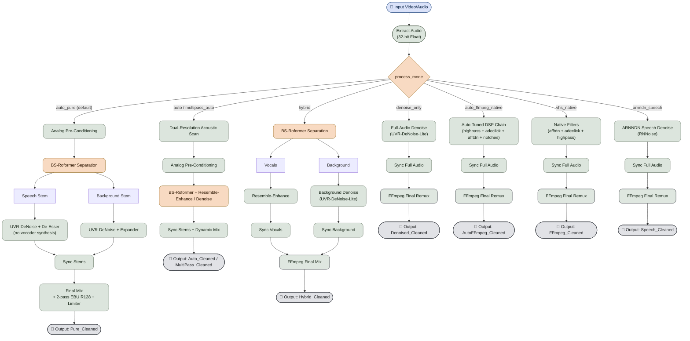

# AI Hybrid VHS Audio Restorer


 

## Documentation

- [README.md](README.md) - General overview and usage.
- [.agent/instructions.md](.agent/instructions.md) - Technical guide for AI
  agents and developers.
- [docs/pipeline_logic.md](docs/pipeline_logic.md) - Detailed pipeline schema.
- [docs/architecture.md](docs/architecture.md) - System architecture and module
  responsibilities.
- [docs/setup.md](docs/setup.md) - Environment and installation setup steps.
- [docs/validation.md](docs/validation.md) - Local and CI validation process.
- [docs/instructions.md](docs/instructions.md) - Contributor instructions and
  workflow rules.

## 🛠️ Restoration Pipeline

A specialized audio restoration pipeline designed to remaster VHS recordings.

## The Pipeline

The pipeline supports multiple execution modes controlled by `process_mode`:

1. **`auto_pure` (4-pass pure speech & ambient denoising engine - default)**

- Extract audio.
- Pass 1: Dual-resolution acoustic scan (profiling speech, music, ambience,
  noise).
- Pass 2: Precision analog hardware pre-conditioning DSP (DC nulling, balance).
- Pass 3: Dual-track AI stem separation (BS-Roformer) with pure neural speech
  denoising (UVR-DeNoise + de-esser, bypassing vocoder synthesis) and pure
  music/ambient background conservation (UVR-DeNoise + dynamic expander).
- Pass 4: Sub-sample DTW/shift synchronization and 32-bit float intermediate mix.
- Output suffix: `*_Pure_Cleaned.<ext>`.

1. **`auto` (AI auto-detection & restoration engine)**

- Extract audio.
- Perform deep AI acoustic profiling (speech formants, environmental textures
  like birds/cars, musical harmonics, noise floor, mains hum, and rumble).
- Automatically select the optimal restoration engine (`hybrid`,
  `denoise_only`, or `auto_ffmpeg_native`) and dynamically choose the best AI
  models (`BS-Roformer`, `UVR-DeNoise`).
- Sync and remux into output video (codecs depend on selected container: AAC
  for `.mp4`/`.m4v`, MP2 for `.mpg`/`.mpeg`, and `pcm_f32le` only for
  configured PCM-capable containers).

1. **`multipass_auto` (4-pass cascaded AI & DSP restoration engine)**

- Extract audio.
- Pass 1: Dual-resolution acoustic scan (global macro & 5s temporal micro map).
- Pass 2: Non-destructive analog pre-conditioning DSP (strips clicks & hum).
- Pass 3: AI stem separation & Resemble-Enhance 256-NFE speech reconstruction.
- Pass 4: Ambient residual polish, sub-sample DTW synchronization, and mix.
- Output suffix: `*_MultiPass_Cleaned.<ext>`.

1. **`hybrid`**

- Extract audio.
- Separate stems with BS-Roformer (Vocals + Background).
- Enhance vocals with Resemble-Enhance.
- Denoise background with UVR-DeNoise-Lite.
- Sync both processed stems to original timing (`shift` or `dtw`).
- Final mix into output video (codecs depend on selected container: AAC
  for `.mp4`/`.m4v`, MP2 for `.mpg`/`.mpeg`, and `pcm_f32le` only for
  configured PCM-capable containers).

1. **`denoise_only`**

- Extract audio.
- Denoise the full audio track with UVR-DeNoise-Lite.
- Sync the denoised full track to original timing (`shift` or `dtw`).
- Final single-track remux into output video (codecs depend on selected
  container: AAC for `.mp4`/`.m4v`, MP2 for `.mpg`/`.mpeg`, and `pcm_f32le`
  only for configured PCM-capable containers).

1. **`auto_ffmpeg_native` (intelligent adaptive FFmpeg DSP restoration)**

- Extract audio.
- Perform acoustic noise profiling across the capture (noise floor estimation,
  50/60 Hz mains hum and head-switching buzz detection, sub-bass rumble
  analysis, and impulsive click spike density).
- Auto-tune the native FFmpeg filter graph (`highpass`, `adeclick`, `afftdn`,
  `bandreject` notch) dynamically based on the measured profile.
- Sync filtered track to original timing (`shift` or `dtw`).
- Final remux into output video (codecs depend on selected container: AAC
  for `.mp4`/`.m4v`, MP2 for `.mpg`/`.mpeg`, and `pcm_f32le` only for
  configured PCM-capable containers).

1. **`vhs_native` (fast native DSP filter chain; `ffmpeg_native` alias)**

- Extract audio.
- Apply native multi-threaded FFmpeg filter chain (`highpass` rumble filter +
  `adeclick` impulsive pop filter + `afftdn` continuous noise tracking +
  optional notch filter).
- Sync filtered track to original timing (`shift` or `dtw`).
- Final remux into output video (codecs depend on selected container: AAC
  for `.mp4`/`.m4v`, MP2 for `.mpg`/`.mpeg`, and `pcm_f32le` only for
  configured PCM-capable containers).

1. **`arnndn_speech` (RNNoise neural dialogue denoiser)**

- Extract audio.
- Apply FFmpeg Recurrent Neural Network denoiser with RNNoise speech model
  (`arnndn=m=cb.rnnn` + `highpass` + `adeclick`).
- Sync denoised track to original timing (`shift` or `dtw`).
- Final remux into output video (codecs depend on selected container: AAC
  for `.mp4`/`.m4v`, MP2 for `.mpg`/`.mpeg`, and `pcm_f32le` only for
  configured PCM-capable containers).

Output naming is mode-specific:

- `auto` -> `*_Auto_Cleaned.<ext>`
- `multipass_auto` -> `*_MultiPass_Cleaned.<ext>`
- `auto_pure` -> `*_Pure_Cleaned.<ext>`
- `hybrid` -> `*_Hybrid_Cleaned.<ext>`
- `denoise_only` -> `*_Denoised_Cleaned.<ext>`
- `auto_ffmpeg_native` -> `*_AutoFFmpeg_Cleaned.<ext>`
- `vhs_native` (`ffmpeg_native` alias) -> `*_FFmpeg_Cleaned.<ext>`
- `arnndn_speech` -> `*_Speech_Cleaned.<ext>`

### 🚀 Smart AI Engine

- **Hybrid GPU Support**: Automatically prioritizes high-performance NVIDIA GPUs
  over Intel/integrated graphics. Ideal for laptops with dual GPUs.
- **Python API Integration**: Uses a direct Python interface for all AI models
  (BS-Roformer, UVR-DeNoise), ensuring better reliability and driver stability
  than command-line calling.
- **Dynamic Batching**: Automatically scales AI batch sizes based on detected
  VRAM to prevent OOM (Out-of-Memory) errors.

### ✨ Key Features

- **Robust Resume**: Automatically detects existing output files for every step.
  If you crash or stop the script, simply run it again. It skips finished work
  and resumes where it left off.
- **Local Temp Files**: Creates hidden temporary folders (e.g.,
  `.temp_work_video_name`) next to your input file, keeping your project root
  clean. Auto-deletes on success.
- **Windows-Ready**: Optimized for standard Windows terminals (cmd/PowerShell)
  with strict 80-column log formatting to prevent wrapping.



## Requirements

The installer handles everything, ensuring compatibility with modern hardware:

- **Python 3.12.x** (in a local `.venv`)
- **FFmpeg 6.1+** (Full Portable Build included & configured)
- **NVIDIA CUDA Toolkit (Self-Contained)**: The installer automatically pulls
  CUDA 13.2-compatible technical libraries (`CUDNN`, `CUBLAS`) from PyPI, so you
  do not need a system-wide CUDA installation.
- **AI Models**: BS-Roformer & UVR-DeNoise-Lite.
- **Runtime Patcher**: Automatically fixes `torchaudio` and `deepspeed` issues
  on Windows, and injects hardware DLLs into the process environment.

## Hardware Auto-Detection Logic

The script automatically scales performance based on your GPU VRAM:

- **EXTREME**: 24 GB or more; examples: RTX 3090, 4090, 5090, or A6000;
  batch size 32.
- **HIGH**: 15 GB to under 24 GB; examples: RTX 3080 16GB, 4080, or 5080;
  batch size 8.
- **MID**: 10 GB to under 15 GB; examples: RTX 3080 10GB/12GB or 4070;
  batch size 4.
- **LOW**: under 10 GB; examples: RTX 3070, entry-level, or older cards;
  batch size 1.

> [!TIP]
> **Smart OOM Recovery**: If an operation fails (GPU or CPU memory pressure), the
> script automatically retries with reduced settings: GPU steps: Halves the batch
> size until success. CPU steps (FFmpeg): Halves the thread count until success.

<!-- -->

> [!NOTE]
> CPU threads are automatically set to your maximum available cores (e.g., 32
> threads for Ryzen 9950X3D).


## ⚙️ Configuration

The application uses a `config.yaml` file for easy customization. A default
configuration is loaded automatically if the file does not exist.

### **Default `config.yaml`:**

```yaml
# Audio Mix Levels (0.0 to 1.0 or higher)
vocal_mix_volume: 1.0
background_mix_volume: 1.0

# Supported Video Extensions
extensions:
  - .mp4
  - .mkv
  - .avi
  - .mov

# Synchronization Method
sync_method: "shift"     # 'shift' (default) or 'dtw' (correction for wow/flutter)
dtw_resolution: 40       # Analysis resolution in Hz (lower = faster)

# Processing Mode
process_mode: "auto_pure"   # 4-pass pure speech & ambient denoising engine (default)
```

## Requirements & Compatibility

- **Operating Systems**:
  - **Linux**: Ubuntu 22.04+, Debian 12+, Fedora, Arch Linux (NVIDIA CUDA /
    CPU).
  - **macOS**: macOS 13+ (Ventura, Sonoma, Sequoia) on Apple Silicon
    (M1/M2/M3/M4) accelerated via **Metal Performance Shaders (MPS)** or Intel
    x86_64 CPU.
  - **Windows**: Windows 10 / 11 (64-bit) with the tested NVIDIA CUDA 13.2
    stack or CPU
    fallback.
- **Python**: Python `>= 3.12, < 3.13` (managed via Poetry & in-project
  `.venv`).
- **Media Binaries**: `ffmpeg` and `ffprobe` in system PATH or environment.

## Installation & Setup

### Linux & macOS

```bash
# 1. Ensure FFmpeg is installed
# On Debian/Ubuntu: sudo apt-get install -y ffmpeg
# On macOS (Homebrew): brew install ffmpeg

# 2. Make scripts executable and run installer
chmod +x install_dependencies.sh start.sh run_pipeline_locally.sh
./install_dependencies.sh
```

For Apple Silicon Macs, download the `macos-arm64` release archive and run the
commands above from a native Terminal session (not Rosetta). Intel Macs should
download `macos-intel`. The installer selects the macOS PyTorch dependencies
and uses MPS when it is available.

### Windows

```powershell
# Run PowerShell installer
powershell -ExecutionPolicy Bypass -File .\install_dependencies.ps1
```

## Usage

### Option A: Drag & Drop (GUI / Desktop)

- **Linux / macOS**: Pass video file paths to `./start.sh "path/to/video.mp4"`.
- **Windows**: Drag and drop your video file(s) or folder directly onto
  `start.bat`.

### Option B: Interactive Mode (Default)

Launch `./start.sh` (Linux/macOS) or double-click `start.bat` (Windows) without
arguments.

- The initialization sequence scans your CPU, GPU, and acceleration backend
  (CUDA / MPS / CPU).
- Press **Enter** to scan and process all video files in the `input/` folder.
- Restored videos are saved in the same directory as each source file.

### Option C: CLI Mode

```bash
# Linux / macOS
./start.sh "/path/to/video.mp4"

# Windows
python restore_audio_hybrid.py "C:\Path\To\Video.mp4"
```

Pass `--help` (or `-h`) to `start.sh`, `start.bat`, or
`restore_audio_hybrid.py` to print usage and exit without processing.

## Development & Testing

### Code Structure

The project is organized into a modular package structure:

- `modules/`: Core logic package.
  - `config.py`: Configuration loading.
  - `utils.py`: Utility functions (logging, validation).
  - `hardware.py`: Hardware detection and profile selection.
  - `sync.py`: Audio synchronization engines (Shift, DTW).
  - `processing.py`: Main audio processing pipeline steps.
  - `ui.py`: Terminal UI and file scanning.
- `restore_audio_hybrid.py`: Main entry point (calls `modules.processing`).

### Code Quality

- **Linting/Formatting**: `black`, `isort`, `ruff`, `flake8`, `pylint`, and
  `taplo` (max-line-length=140 for Python).
- **Security Scanning**: `bandit -ll -ii` and `pip-audit`.
- **Markdown Quality**: Read-only `mdformat --check` validation and
  `pymarkdown` lint checks.
- **PowerShell Linting**: `PSScriptAnalyzer` via
  `.github/scripts/Invoke-PowerShellLint.ps1`.
- **Type Checking (Advisory)**: `mypy` is available for local analysis, but it
  is not an enforced local/CI gate.
- **Complexity Gates**: `radon` reports plus strict pass gates
  (`tests/tooling/radon_cc_gate.py`, `tests/tooling/radon_mi_gate.py`).

### Testing

Tests are run using `pytest` with `pytest-cov`.

```powershell
.\run_pipeline_locally.ps1
```

The local pipeline runs the same quality gates as CI (PowerShell lint, Black,
isort, Ruff, Flake8, Taplo, Pylint, Bandit, pip-audit, Radon reports/gates,
Markdown format check and lint, tests with coverage) and overwrites
`assets/coverage.svg` at the end. It also enforces strict per-file coverage
using `tests/tooling/quality_gate.py` against `coverage.json`.

### Coverage Goal

The project enforces two mandatory coverage gates:

- **Total coverage** must stay at **>= 90%**.
- **Per-file coverage** for every measured file must be **>= 90%**

Both local validation and CI fail when either gate is violated.

## Credits

- **Audio-Separator**:
  [beveradb/audio-separator](https://github.com/beveradb/audio-separator)
- **Resemble-Enhance**:
  [resemble-ai/resemble-enhance](https://github.com/resemble-ai/resemble-enhance)
- **FFmpeg**: [ffmpeg.org](https://ffmpeg.org/)
