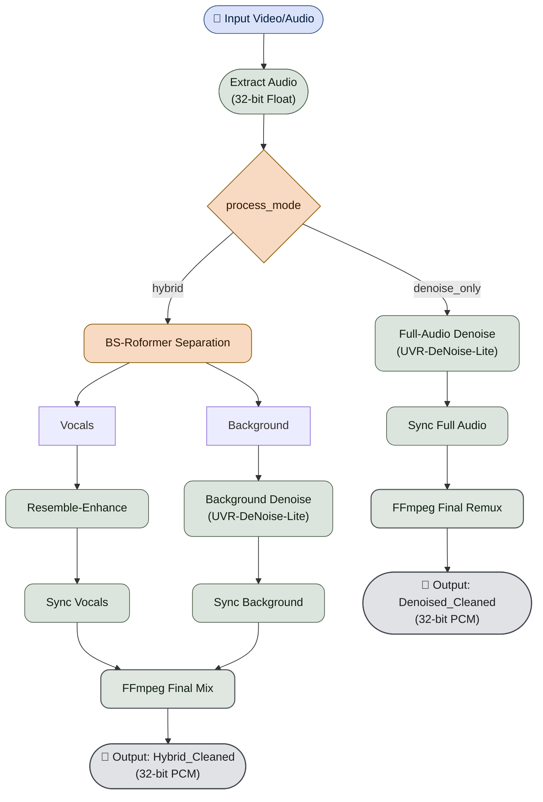
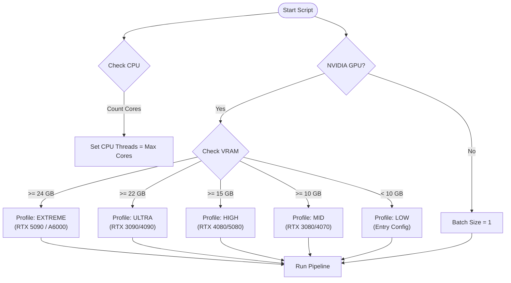

# AI Hybrid VHS Audio Restorer


 

## Documentation

- [README.md](README.md) - General overview and usage.
- [.agent/instructions.md](.agent/instructions.md) - Technical guide for
  AI agents and developers.
- [docs/pipeline_logic.md](docs/pipeline_logic.md) - Detailed pipeline schema.
- [docs/architecture.md](docs/architecture.md) - System architecture and
  module responsibilities.
- [docs/setup.md](docs/setup.md) - Environment and installation setup steps.
- [docs/validation.md](docs/validation.md) - Local and CI validation process.
- [docs/instructions.md](docs/instructions.md) - Contributor
  instructions and workflow rules.

## 🛠️ Restoration Pipeline

A specialized audio restoration pipeline designed to remaster VHS recordings.

## The Pipeline

The pipeline supports two execution modes controlled by `process_mode`:

1. **`hybrid`**

- Extract audio.
- Separate stems with BS-Roformer (Vocals + Background).
- Enhance vocals with Resemble-Enhance.
- Denoise background with UVR-DeNoise-Lite.
- Sync both processed stems to original timing (`shift` or `dtw`).
- Final mix into output video as **32-bit float PCM (`pcm_f32le`)** audio.

1. **`denoise_only` (default/fallback mode)**

- Extract audio.
- Denoise the full audio track with UVR-DeNoise-Lite.
- Sync the denoised full track to original timing (`shift` or `dtw`).
- Final single-track remux into output video as **32-bit float PCM
  (`pcm_f32le`)** audio.

Output naming is mode-specific:

- `hybrid` -> `*_Hybrid_Cleaned.<ext>`
- `denoise_only` -> `*_Denoised_Cleaned.<ext>`

### 🚀 Smart AI Engine

- **Hybrid GPU Support**: Automatically prioritizes high-performance
  NVIDIA GPUs over Intel/integrated graphics. Ideal for laptops with
  dual GPUs.
- **Python API Integration**: Uses a direct Python interface for all AI
  models (BS-Roformer, UVR-DeNoise), ensuring better reliability and
  driver stability than command-line calling.
- **Dynamic Batching**: Automatically scales AI batch sizes based on
  detected VRAM to prevent OOM (Out-of-Memory) errors.

### ✨ Key Features

- **Robust Resume**: Automatically detects existing output files for
  every step. If you crash or stop the script, simply run it again. It
  skips finished work and resumes where it left off.
- **Local Temp Files**: Creates hidden temporary folders (e.g.,
  `.temp_work_video_name`) next to your input file, keeping your
  project root clean. Auto-deletes on success.
- **Windows-Ready**: Optimized for standard Windows terminals
  (cmd/PowerShell) with strict 80-column log formatting to prevent
  wrapping.



## Requirements

The installer handles everything, ensuring compatibility with modern hardware:

- **Python 3.12.x** (in a local `.venv`)
- **FFmpeg 6.1+** (Full Portable Build included & configured)
- **NVIDIA CUDA Toolkit (Self-Contained)**: The installer
  automatically pulls CUDA 13.2-compatible technical libraries
  (`CUDNN`, `CUBLAS`) from PyPI, so you do not need a system-wide
  CUDA installation.
- **AI Models**: BS-Roformer & UVR-DeNoise-Lite.
- **Runtime Patcher**: Automatically fixes `torchaudio` and
  `deepspeed` issues on Windows, and injects hardware DLLs into the
  process environment.

## Hardware Auto-Detection Logic

The script automatically scales performance based on your GPU VRAM:

| Profile | VRAM | Example GPUs | Batch Size |
| :--- | :--- | :--- | :--- |
| **EXTREME** | ≥ 24 GB | RTX 3090 / 4090 / 5090 | 32 |
| **HIGH** | ≥ 15 GB | RTX 3080 / 4080 / 5080 | 8 |
| **MID** | ≥ 10 GB | RTX 3070 / 4070 | 4 |
| **LOW** | < 10 GB | Entry Level / Older Cards | 1 |

> [!TIP]
> **Smart OOM Recovery**: If an operation fails (GPU or CPU memory
> pressure), the script automatically retries with reduced settings:
> GPU steps: Halves the batch size until success.
> CPU steps (FFmpeg): Halves the thread count until success.
> [!NOTE]
> CPU threads are automatically set to your maximum available cores
> (e.g., 32 threads for Ryzen 9950X3D).



## ⚙️ Configuration

The application uses a `config.yaml` file for easy customization. A
default configuration is loaded automatically if the file does not
exist.

### **Default `config.yaml`:**

```yaml
# Audio Mix Levels (0.0 to 1.0 or higher)
vocal_mix_volume: 1.0
background_mix_volume: 1.0

# Supported Video Extensions
extensions:
  - .mp4
  - .mkv
  - .avi
  - .mov

# Synchronization Method
sync_method: "shift"     # 'shift' (default) or 'dtw' (correction for wow/flutter)
dtw_resolution: 40       # Analysis resolution in Hz (lower = faster)

# Processing Mode
process_mode: "denoise_only"   # default/fallback; set 'hybrid' for Separation+Enhance
```

## Usage

1. Run `install_dependencies.ps1` to set up the environment.

### Option A: Drag & Drop (Recommended)

Simply **drag and drop** your video file(s) or a folder containing
videos directly onto `start.bat` (or the Python script).

- **Output**: The restored video is saved in the **same folder** as
  your original video.

- `hybrid` mode: `*_Hybrid_Cleaned.<ext>`

- `denoise_only` mode: `*_Denoised_Cleaned.<ext>`

### Option B: Interactive Mode (Default)

Double-click `start.bat` without any files.

- The script will Launch and show your System Stats.

- Press **Enter** to automatically scan and process all files in the
  `input` folder.

- **Output**: Restored videos are saved in the **same folder** as each original video.

### Option C: CLI

Run via command line with arguments:

```powershell
python restore_audio_hybrid.py "C:\Path\To\Video.mp4"
```

- **Output**: The restored video is saved in the **same folder** as the input video.

## Development & Testing

### Code Structure

The project is organized into a modular package structure:

- `modules/`: Core logic package.
  - `config.py`: Configuration loading.
  - `utils.py`: Utility functions (logging, validation).
  - `hardware.py`: Hardware detection and profile selection.
  - `sync.py`: Audio synchronization engines (Shift, DTW).
  - `processing.py`: Main audio processing pipeline steps.
  - `ui.py`: Terminal UI and file scanning.
- `restore_audio_hybrid.py`: Main entry point (calls `modules.processing`).

### Code Quality

- **Linting**: `ruff`, `flake8`, and `pylint` (max-line-length=140).
- **Markdown Quality**: `mdformat` (automatic delint/format) and
  `pymarkdownlnt` lint checks.
- **PowerShell Linting**: `PSScriptAnalyzer` via `.github/scripts/Invoke-PowerShellLint.ps1`.
- **Type Checking (Advisory)**: `mypy` is available for local analysis,
  but it is not an enforced local/CI gate.
- **Complexity (Advisory)**: `radon` is used for
  reporting/monitoring, but it is not an enforced local/CI gate.

### Testing

Tests are run using `pytest` with `pytest-cov`.

```powershell
.\run_pipeline_locally.ps1
```

The local pipeline runs the same quality gates as CI (PowerShell lint,
Ruff, Flake8, Pylint, Markdown auto-delint/lint, tests with coverage)
and overwrites `assets/coverage.svg` at the end.
It also enforces strict per-file coverage using
`tests/tooling/quality_gate.py` against `coverage.json`.

### Coverage Goal

The project enforces two mandatory coverage gates:

- **Total coverage** must stay at **>= 90%**.
- **Per-file coverage** for every measured file must be **>= 90%**

Both local validation and CI fail when either gate is violated.

## Credits

- **Audio-Separator**: [beveradb/audio-separator](https://github.com/beveradb/audio-separator)
- **Resemble-Enhance**: [resemble-ai/resemble-enhance](https://github.com/resemble-ai/resemble-enhance)
- **FFmpeg**: [ffmpeg.org](https://ffmpeg.org/)
