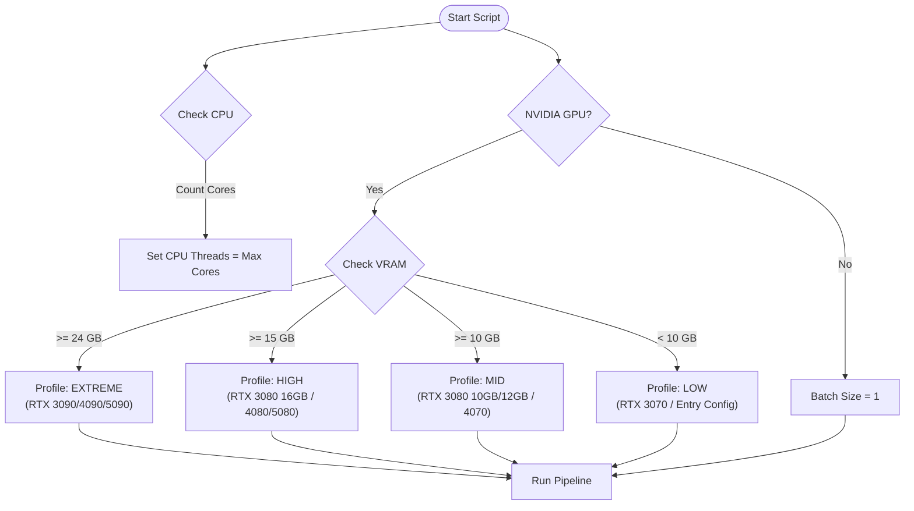

# AI Hybrid VHS Audio Restorer


 
[](https://sonarcloud.io/summary/new_code?id=ventura8_AI-Hybrid-VHS-Audio-Restorer)
[![Downloads][downloads-badge]][releases]

## Documentation

- [README.md](README.md) - General overview and usage.
- [.agent/instructions.md](.agent/instructions.md) - Technical guide for AI
  agents and developers.
- [docs/pipeline_logic.md](docs/pipeline_logic.md) - Detailed pipeline schema.
- [docs/architecture.md](docs/architecture.md) - System architecture and module
  responsibilities.
- [docs/setup.md](docs/setup.md) - Environment and installation setup steps.
- [docs/validation.md](docs/validation.md) - Local and CI validation process.
- [docs/instructions.md](docs/instructions.md) - Contributor instructions and
  workflow rules.
- [.agent/workflows/run_hardware_validation.md](.agent/workflows/run_hardware_validation.md)
  - Reproducible Piper fixture generation and physical accelerator validation.

## Hardware Validation Fixtures

The optional hardware-validation suite generates deterministic Piper VITS speech
at short, mid, and long-form durations, then injects reproducible VHS defects
such as tape hiss, mains hum, CRT line whistle, rumble, stereo azimuth offset,
clicks, clipping, dropout, and drift markers. It does not download a voice
model or run accelerator inference as part of normal tests.

First audit the local machine:

```powershell
poetry run python scripts/audit_hardware.py
powershell -NoProfile -ExecutionPolicy Bypass -File .\scripts\audit_hardware.ps1
```

Piper runs from its own Poetry-managed environment at
`tools/piper-tts/.venv`. The installer provisions it automatically, keeping
Piper's CPU ONNX Runtime separate from the main CUDA/TensorRT runtime. To
provision it in an existing checkout, rerun `install_dependencies.ps1`.

The catalog contains 50 language-native, checksum-pinned Piper voices. Generate
the short and mid fixture set for every language (or repeat `--language` with
specific ISO codes for a focused run):

```powershell
poetry run python scripts/generate_audio_matrix.py core --language all
poetry run python scripts/run_hardware_validation.py core
```

The generated files live under `artifacts/`, which should remain untracked.
Physical checks are opt-in: `--execute` runs generated fixtures through the
hardware-validation runner, while `AI_RESTORE_HARDWARE_TESTS=1` enables the
separate hardware pytest suite. They are not equivalent, and both keep normal
CI and developer tests independent of GPU availability.

## Acknowledgments

The optional Cathar restoration path is inspired by and gratefully acknowledges
[Cathar](https://github.com/vbasky/cathar), a transparent pure-Rust audio
restoration toolkit by vbasky. Cathar's inspectable DSP approach helped inform
the project's native restoration design.

Cathar's repository does not currently publish a dedicated donation link. If
you find it useful, please consider starring or contributing to
[Cathar on GitHub](https://github.com/vbasky/cathar).

## 🛠️ Restoration Pipeline

A specialized audio restoration pipeline designed to remaster VHS recordings.

## The Pipeline

The pipeline supports multiple execution modes controlled by `process_mode`:

1. **`auto_pure_linear` (linear full-mix pure denoising)**

- Reuses `auto_pure` profiling, analog pre-conditioning, sync, mastering, and
  remuxing, but skips stem separation and treats the full mix.
- Repairs physical tape damage where it is detected (crackle, dropouts,
  saturation, azimuth skew), cancels mains hum harmonic by harmonic at the
  frequency each actually sits at, tames plosives as events, subtracts a
  learned noise profile, blends the result back toward the original per
  frequency bin, then applies UVR-DeNoise.
- Removes more tape noise than `cathar` while disturbing the programme less,
  measured across 136 clips, and removes the mains hum neither mode used to
  touch: a median 1.19 dB of harmonic excess on the readable humming tapes
  against `cathar`'s -0.74. See
  [the head-to-head benchmark](docs/cathar_vs_auto_pure_linear_1000_benchmark.md).
- Output suffix: `*_PureLinear_Cleaned.<ext>`.

1. **`auto_pure` (4-pass pure speech & ambient denoising engine)**

- Extract audio.
- Pass 1: Dual-resolution acoustic scan (profiling speech, music, ambience,
  noise).
- Pass 2: Precision analog hardware pre-conditioning DSP (DC nulling, balance).
- Pass 3: Dual-track AI stem separation (BS-Roformer) with pure neural speech
  denoising (UVR-DeNoise + de-esser, bypassing vocoder synthesis) and pure
  music/ambient background conservation (UVR-DeNoise + dynamic expander).
- Pass 4: Sub-sample DTW/shift synchronization and 32-bit float intermediate mix.
- Output suffix: `*_Pure_Cleaned.<ext>`.

1. **`auto` (AI auto-detection & restoration engine - default)**

- Extract audio.
- Perform deep AI acoustic profiling (speech formants, environmental textures
  like birds/cars, musical harmonics, rhythm, spectral flatness, noise floor,
  mains hum, and rumble) and name the material: dialogue, rhythmic music,
  non-vocal music or ambience, or tape noise.
- Run the engine the real-tape corpus says is best for it: `auto_pure_linear` on
  every class (10.10 dB of noise removed for 0.31 dB of programme deviation over
  136 clips against `cathar`'s 6.02/0.44, and against 0.35/0.16 for
  `denoise_only` and 0.72/0.06 for `auto_ffmpeg_native`, the engines earlier
  releases ran for music and tape noise); `cathar`, the deterministic DSP
  engine, on sustained tonal programme with no silence for the noise probe to
  learn from (where it deviates less on two clips in three, for 2-3 dB less
  removal) and when the neural denoiser is not installed (when cathar is
  installed; with neither engine available the `auto_ffmpeg_native` chain is the
  last resort). The pre-conditioning filters and the models (`UVR-DeNoise`,
  `UVR-DeNoise-Lite`) follow the scan.
- Sync and remux into output video (codecs depend on selected container: AAC
  for `.mp4`/`.m4v`, MP2 for `.mpg`/`.mpeg`, and `pcm_f32le` only for
  configured PCM-capable containers).

1. **`multipass_auto` (4-pass cascaded AI & DSP restoration engine)**

- Extract audio.
- Pass 1: Dual-resolution acoustic scan (global macro & 5s temporal micro map).
- Pass 2: Non-destructive analog pre-conditioning DSP (strips clicks & hum).
- Pass 3: AI stem separation & Resemble-Enhance 256-NFE speech reconstruction.
- Pass 4: Ambient residual polish, sub-sample DTW synchronization, and mix.
- Output suffix: `*_MultiPass_Cleaned.<ext>`.

1. **`hybrid`**

- Extract audio.
- Separate stems with BS-Roformer (Vocals + Background).
- Enhance vocals with Resemble-Enhance.
- Denoise background with UVR-DeNoise-Lite.
- Sync both processed stems to original timing (`shift` or `dtw`).
- Final mix into output video (codecs depend on selected container: AAC
  for `.mp4`/`.m4v`, MP2 for `.mpg`/`.mpeg`, and `pcm_f32le` only for
  configured PCM-capable containers).

1. **`denoise_only`**

- Extract audio.
- Denoise the full audio track with UVR-DeNoise-Lite.
- Sync the denoised full track to original timing (`shift` or `dtw`).
- Final single-track remux into output video (codecs depend on selected
  container: AAC for `.mp4`/`.m4v`, MP2 for `.mpg`/`.mpeg`, and `pcm_f32le`
  only for configured PCM-capable containers).

1. **`auto_ffmpeg_native` (intelligent adaptive FFmpeg DSP restoration)**

- Extract audio.
- Perform acoustic noise profiling across the capture (noise floor estimation,
  50/60 Hz mains hum and head-switching buzz detection, sub-bass rumble
  analysis, and impulsive click spike density).
- Auto-tune the native FFmpeg filter graph (`highpass`, `adeclick`, `afftdn`,
  `bandreject` notch) dynamically based on the measured profile.
- Sync filtered track to original timing (`shift` or `dtw`).
- Final remux into output video (codecs depend on selected container: AAC
  for `.mp4`/`.m4v`, MP2 for `.mpg`/`.mpeg`, and `pcm_f32le` only for
  configured PCM-capable containers).

1. **`vhs_native` (fast native DSP filter chain; `ffmpeg_native` alias)**

- Extract audio.
- Apply native multi-threaded FFmpeg filter chain (`highpass` rumble filter +
  `adeclick` impulsive pop filter + `afftdn` continuous noise tracking +
  optional notch filter).
- Sync filtered track to original timing (`shift` or `dtw`).
- Final remux into output video (codecs depend on selected container: AAC
  for `.mp4`/`.m4v`, MP2 for `.mpg`/`.mpeg`, and `pcm_f32le` only for
  configured PCM-capable containers).

1. **`arnndn_speech` (RNNoise neural dialogue denoiser)**

- Extract audio.
- Apply FFmpeg Recurrent Neural Network denoiser with RNNoise speech model
  (`arnndn=m=cb.rnnn` + `highpass` + `adeclick`).
- Sync denoised track to original timing (`shift` or `dtw`).
- Final remux into output video (codecs depend on selected container: AAC
  for `.mp4`/`.m4v`, MP2 for `.mpg`/`.mpeg`, and `pcm_f32le` only for
  configured PCM-capable containers).

1. **`cathar` (pure-Rust DSP restoration suite; `cathar_vhs` alias)**

- Extract audio.
- Pass 1: Analog pre-conditioning (DC offset blocker, dewind rumble filter,
  stereo azimuth alignment, correlation phase recovery).
- Pass 2: Tape defect repair (AR declicker, decrackle surface noise filter,
  SPADE de-clipper for saturated preamp stages).
- Pass 3: Surgical dehumming (adaptive notch tracking for detected 50/60 Hz
  mains) with analog transport pitch-drift smoothing only when dewow is
  explicitly enabled.
- Pass 4: Coherent spectral subtraction / Wiener denoising, de-essing, and
  SBR enhancement.
- Sync restored track to original timing (`shift` or `dtw`).
- Final remux into output video.
- Output suffix: `*_Cathar_Cleaned.<ext>`.

Output naming is mode-specific:

- `auto` -> `*_Auto_Cleaned.<ext>`
- `multipass_auto` -> `*_MultiPass_Cleaned.<ext>`
- `auto_pure` -> `*_Pure_Cleaned.<ext>`
- `auto_pure_linear` -> `*_PureLinear_Cleaned.<ext>`
- `cathar` (`cathar_vhs` alias) -> `*_Cathar_Cleaned.<ext>`
- `hybrid` -> `*_Hybrid_Cleaned.<ext>`
- `denoise_only` -> `*_Denoised_Cleaned.<ext>`
- `auto_ffmpeg_native` -> `*_AutoFFmpeg_Cleaned.<ext>`
- `vhs_native` (`ffmpeg_native` alias) -> `*_FFmpeg_Cleaned.<ext>`
- `arnndn_speech` -> `*_Speech_Cleaned.<ext>`

### 🚀 Smart AI Engine

- **Hybrid GPU Support**: Automatically prioritizes high-performance NVIDIA GPUs
  over Intel/integrated graphics. Ideal for laptops with dual GPUs.
- **Python API Integration**: Uses a direct Python interface for all AI models
  (BS-Roformer, UVR-DeNoise), ensuring better reliability and driver stability
  than command-line calling.
- **Dynamic Batching**: Automatically scales AI batch sizes based on detected
  VRAM to prevent OOM (Out-of-Memory) errors.

### ✨ Key Features

- **Robust Resume**: Automatically detects existing output files for every step.
  If you crash, lose power or stop the script, simply run it again. Every stage
  publishes its file only once complete, unfinished partials are swept on the
  next start, and finished work is skipped.
- **Local Temp Files**: Creates one hidden temporary folder (e.g.,
  `.temp_work_video_name`) next to your input file that holds every
  intermediate, the staged final render and library scratch, keeping your
  project root and system temp clean. Auto-deletes on success.
- **Windows-Ready**: Optimized for standard Windows terminals (cmd/PowerShell)
  with strict 80-column log formatting to prevent wrapping.

```mermaid
flowchart TD
%% Material You (Material 3) Muted Tonal Palette
classDef input fill:#DAE2F9,stroke:#3F5F91,stroke-width:1px,color:#001B3E,rx:40,ry:40;
classDef processing fill:#DCE5DD,stroke:#526350,stroke-width:1px,color:#101E10,rx:12,ry:12;
classDef model fill:#F8DAC2,stroke:#825500,stroke-width:1px,color:#2D1600,rx:12,ry:12;
classDef output fill:#E1E2E6,stroke:#44474E,stroke-width:1.5px,color:#1A1C1E,rx:40,ry:40;

A(["📼 Input Video/Audio"]):::input --> B(["Extract Audio<br/>(32-bit Float)"]):::processing
B --> MODE{"process_mode"}:::model

MODE -->|"auto_pure_linear"| LP1["Acoustic Scan +<br/>Analog Pre-Conditioning"]:::processing
LP1 --> LPR["Gated Damage Repair<br/>(crackle, dropout, clip, azimuth)"]:::processing
LPR --> LPH["Hum Cancellation +<br/>Plosive Control"]:::processing
LPH --> LPS["Noise-Profile Subtraction +<br/>Learned Per-Bin Blend"]:::processing
LPS --> LP2["UVR-DeNoise on the<br/>Repaired, Subtracted, Blended Mix"]:::model
LP2 --> LP3["Sync Full Mix +<br/>EBU R128 + Limiter"]:::processing
LP3 --> LPOUT(["💾 Output: PureLinear_Cleaned"]):::output

MODE -->|"auto_pure"| PP["Analog Pre-Conditioning"]:::processing
PP --> PS["BS-Roformer Separation"]:::model
PS --> PV["Speech Stem"]
PS --> PB["Background Stem"]
PV --> PVD["UVR-DeNoise + De-Esser<br/>(no vocoder synthesis)"]:::processing
PB --> PBD["UVR-DeNoise + Expander"]:::processing
PVD --> PSY["Sync Stems"]:::processing
PBD --> PSY
PSY --> PMIX["Final Mix<br/>+ 2-pass EBU R128 + Limiter"]:::processing
PMIX --> POUT(["💾 Output: Pure_Cleaned"]):::output

MODE -->|"auto (default)"| AU1["Acoustic Scan:<br/>material, tonality, hum, drift"]:::processing
AU1 --> AU2{"Neural denoiser<br/>installed?"}:::model
AU2 -->|"yes"| AU5{"Tonal, no silence<br/>for the noise probe,<br/>and cathar installed?"}:::model
AU5 -->|"no"| AU3["auto_pure_linear chain"]:::model
AU5 -->|"yes"| AU4["cathar chain"]:::processing
AU2 -->|"no"| AU6{"cathar<br/>installed?"}:::model
AU6 -->|"yes"| AU4
AU6 -->|"no"| AU7["auto_ffmpeg_native chain"]:::processing
AU3 --> AUOUT(["💾 Output: Auto_Cleaned"]):::output
AU4 --> AUOUT
AU7 --> AUOUT

MODE -->|"multipass_auto"| AP1["Dual-Resolution Acoustic Scan"]:::processing
AP1 --> AP2["Analog Pre-Conditioning"]:::processing
AP2 --> AP3["BS-Roformer + Resemble-Enhance / Denoise"]:::model
AP3 --> AP4["Sync Stems + Dynamic Mix"]:::processing
AP4 --> APOUT(["💾 Output: MultiPass_Cleaned"]):::output

MODE -->|"hybrid"| RO["BS-Roformer Separation"]:::model
RO --> V["Vocals"]
RO --> I["Background"]
V --> VE["Resemble-Enhance"]:::processing
I --> BD["Background Denoise<br/>(UVR-DeNoise-Lite)"]:::processing
VE --> SV["Sync Vocals"]:::processing
BD --> SB["Sync Background"]:::processing
SV --> HMIX["FFmpeg Final Mix"]:::processing
SB --> HMIX
HMIX --> HOUT(["💾 Output: Hybrid_Cleaned"]):::output

MODE -->|"denoise_only"| FD["Full-Audio Denoise<br/>(UVR-DeNoise-Lite)"]:::processing
FD --> FS["Sync Full Audio"]:::processing
FS --> FMUX["FFmpeg Final Remux"]:::processing
FMUX --> FOUT(["💾 Output: Denoised_Cleaned"]):::output

MODE -->|"cathar / cathar_vhs"| CP1["Analog Pre-Conditioning +<br/>Tape Defect Repair"]:::processing
CP1 --> CP2["Surgical Dehumming +<br/>Transport Dewow"]:::processing
CP2 --> CP3["Coherent Denoise +<br/>De-Esser +<br/>SBR Enhance"]:::processing
CP3 --> CP4["Sync Audio + Remux"]:::processing
CP4 --> CPOUT(["💾 Output: Cathar_Cleaned"]):::output

MODE -->|"auto_ffmpeg_native"| AFN["Auto DSP<br/>filters + notches"]:::processing
AFN --> AFS["Sync Full Audio"]:::processing
AFS --> AFMIX["FFmpeg Final Remux"]:::processing
AFMIX --> AFOUT(["💾 Output: AutoFFmpeg_Cleaned"]):::output

MODE -->|"vhs_native"| VN["Native Filters<br/>(afftdn + adeclick + highpass)"]:::processing
VN --> VS["Sync Full Audio"]:::processing
VS --> VMUX["FFmpeg Final Remux"]:::processing
VMUX --> VOUT(["💾 Output: FFmpeg_Cleaned"]):::output

MODE -->|"arnndn_speech"| SN["ARNNDN Speech Denoise<br/>(RNNoise)"]:::processing
SN --> SS["Sync Full Audio"]:::processing
SS --> SMUX["FFmpeg Final Remux"]:::processing
SMUX --> SOUT(["💾 Output: Speech_Cleaned"]):::output

%% Material You Subgraph Styling (Subtle Contours)
style HMIX fill:#DCE5DD,stroke:#44474E,stroke-width:1.5px,opacity:0.9
style FMUX fill:#DCE5DD,stroke:#44474E,stroke-width:1.5px,opacity:0.9
style AFMIX fill:#DCE5DD,stroke:#44474E,stroke-width:1.5px,opacity:0.9
style VMUX fill:#DCE5DD,stroke:#44474E,stroke-width:1.5px,opacity:0.9
style SMUX fill:#DCE5DD,stroke:#44474E,stroke-width:1.5px,opacity:0.9
```



## Requirements

The installer handles everything, ensuring compatibility with modern hardware:

- **Python 3.12.x** (in a local `.venv`)
- **FFmpeg 6.1+** (Full Portable Build included & configured)
- **NVIDIA CUDA Toolkit (Self-Contained)**: The installer automatically pulls
  CUDA 13.2-compatible technical libraries (`CUDNN`, `CUBLAS`) from PyPI, so you
  do not need a system-wide CUDA installation.
- **AI Models**: BS-Roformer & UVR-DeNoise-Lite.
- **Runtime Patcher**: Automatically fixes `torchaudio` and `deepspeed` issues
  on Windows, and injects hardware DLLs into the process environment.

## Hardware Auto-Detection Logic

The script automatically scales performance based on your GPU VRAM:

- **EXTREME**: 24 GB or more; examples: RTX 3090, 4090, 5090, or A6000;
  batch size 32.
- **HIGH**: 15 GB to under 24 GB; examples: RTX 3080 16GB, 4080, or 5080;
  batch size 8.
- **MID**: 10 GB to under 15 GB; examples: RTX 3080 10GB/12GB or 4070;
  batch size 4.
- **LOW**: under 10 GB; examples: RTX 3070, entry-level, or older cards;
  batch size 1.

> [!TIP]
> **Smart OOM Recovery**: If an operation fails (GPU or CPU memory pressure), the
> script automatically retries with reduced settings: GPU steps: Halves the batch
> size until success. CPU steps (FFmpeg): Halves the thread count until success.

<!-- -->

> [!NOTE]
> CPU threads are automatically set to your maximum available cores (e.g., 32
> threads for Ryzen 9950X3D).



## ⚙️ Configuration

The application uses a `config.yaml` file for easy customization. A default
configuration is loaded automatically if the file does not exist.

### **Default `config.yaml`:**

```yaml
# Audio Mix Levels (0.0 to 1.0 or higher)
vocal_mix_volume: 1.0
background_mix_volume: 1.0

# Supported Video Extensions
extensions:
  - .mp4
  - .mkv
  - .avi
  - .mov

# Synchronization Method
sync_method: "shift"     # 'shift' (default) or 'dtw' (correction for wow/flutter)
dtw_resolution: 40       # Analysis resolution in Hz (lower = faster)

# Processing Mode
process_mode: "auto"   # profile the tape and pick the engine (default); "auto_pure_linear" or "cathar" to force one
```

## Requirements & Compatibility

- **Operating Systems**:
  - **Linux**: Ubuntu 22.04+, Debian 12+, Fedora, Arch Linux (NVIDIA CUDA /
    CPU).
  - **macOS**: macOS 13+ (Ventura, Sonoma, Sequoia) on Apple Silicon
    (M1/M2/M3/M4) accelerated via **Metal Performance Shaders (MPS)**. Intel
    x86_64 Macs are supported for the FFmpeg-native DSP modes only
    (`vhs_native`, `auto_ffmpeg_native`, `arnndn_speech`): `numba`/`llvmlite`
    no longer ship Intel-mac wheels, so the AI separation and neural
    enhancement stack is not installed there.
  - **Windows**: Windows 10 / 11 (64-bit) with the tested NVIDIA CUDA 13.2
    stack or CPU
    fallback.
- **Python**: Python `>= 3.12, < 3.13` (managed via Poetry & in-project
  `.venv`).
- **Media Binaries**: `ffmpeg` and `ffprobe` in system PATH or environment.

## Installation & Setup

### Native Installers & Executables (Recommended)

- **Windows**: Download and double-click `AI-Hybrid-VHS-Audio-Restorer-v*-windows.exe`
  (auto-installs environment on first run, supports CLI arguments & drag-and-drop).
- **macOS (Apple Silicon / Intel)**: Download `.pkg` (`macos-arm64` or `macos-x86_64`)
  to install `/Applications/AI-Hybrid-VHS-Audio-Restorer.app` and `ai-hybrid-vhs-audio-restorer`
  command.
- **Linux (Ubuntu / Debian)**: Download `.deb` from GitHub Releases and run
  `sudo dpkg -i AI-Hybrid-VHS-Audio-Restorer-v*-linux.deb`.
- **Linux (Fedora / RHEL)**: Download `.rpm` from GitHub Releases and run
  `sudo rpm -i AI-Hybrid-VHS-Audio-Restorer-v*-linux.rpm`.

### Manual Source Setup

#### Linux & macOS

```bash
# 1. Ensure FFmpeg is installed
# On Debian/Ubuntu: sudo apt-get install -y ffmpeg
# On macOS (Homebrew): brew install ffmpeg

# 2. Make scripts executable and run installer
chmod +x install_dependencies.sh start.sh run_pipeline_locally.sh
./install_dependencies.sh
```

#### Windows

```powershell
powershell -ExecutionPolicy Bypass -File .\install_dependencies.ps1
```

## Usage

### Option A: Drag & Drop (GUI / Desktop)

- **Linux / macOS**: Pass video file paths to `./start.sh "path/to/video.mp4"`.
- **Windows**: Drag and drop your video file(s) or folder directly onto
  `start.bat`.

### Option B: Interactive Mode (Default)

Launch `./start.sh` (Linux/macOS) or double-click `start.bat` (Windows) without
arguments.

- The initialization sequence scans your CPU, GPU, and acceleration backend
  (CUDA / MPS / CPU).
- Press **Enter** to scan and process all video files in the `input/` folder.
- Restored videos are saved in the same directory as each source file.

### Option C: CLI Mode

```bash
# Linux / macOS
./start.sh "/path/to/video.mp4"

# Windows
python restore_audio_hybrid.py "C:\Path\To\Video.mp4"
```

Pass `--help` (or `-h`) to `start.sh`, `start.bat`, or
`restore_audio_hybrid.py` to print usage and exit without processing.

A folder of tapes goes faster with `batch_jobs` in `config.yaml`: that many
files restore at once, each in its own interpreter with its own log under
`logs/`, and every file's output is the same bytes as when it runs alone. The
cathar engine is single-threaded, so this is the only way it uses more cores;
neural modes hold their models on the GPU once per job.

## Development & Testing

### Code Structure

The project is organized into a modular package structure:

- `modules/`: Core logic package.
  - `config.py`: Configuration loading.
  - `utils.py`: Utility functions (logging, validation).
  - `hardware.py`: Hardware detection and profile selection.
  - `sync.py`: Audio synchronization engines (Shift, DTW).
  - `processing.py`: Main audio processing pipeline steps.
  - `ui.py`: Terminal UI and file scanning.
- `restore_audio_hybrid.py`: Main entry point (calls `modules.processing`).

### Code Quality

- **Linting/Formatting**: `black`, `isort`, `ruff`, `flake8`, `pylint`, and
  `taplo` (max-line-length=140 for Python).
- **Security Scanning**: `bandit -ll -ii` and `pip-audit`.
- **Markdown Quality**: Read-only `mdformat --check` validation and
  `pymarkdown` lint checks.
- **PowerShell Linting**: `PSScriptAnalyzer` via
  `.github/scripts/Invoke-PowerShellLint.ps1`.
- **Type Checking (Advisory)**: `mypy` is available for local analysis, but it
  is not an enforced local/CI gate.
- **Complexity Gates**: `radon` reports plus strict pass gates
  (`tests/tooling/radon_cc_gate.py`, `tests/tooling/radon_mi_gate.py`).

### Testing

Tests are run using `pytest` with `pytest-cov`.

```powershell
.\run_pipeline_locally.ps1
```

The local pipeline runs the same quality gates as CI (PowerShell lint, Black,
isort, Ruff, Flake8, Taplo, Pylint, Bandit, pip-audit, Radon reports/gates,
Markdown format check and lint, tests with coverage) and overwrites
`assets/coverage.svg` at the end. It also enforces strict per-file coverage
using `tests/tooling/quality_gate.py` against `coverage.json`.

### Validating an output by ear-like metrics

`scripts/validate_restoration.py` scores a restored file against its
source (words, timbre, highs, musical noise, hiss, hum, background) and
renders a listening set of the worst windows; `scripts/tune_restoration.py`
sweeps engine settings on excerpts of your own tapes with it. See
`docs/validation.md`, "Output validation harness".

```powershell
.\.venv\Scripts\python.exe scripts\download_quality_models.py
.\.venv\Scripts\python.exe scripts\validate_restoration.py tape.mov `
    cathar=tape_Cathar_Cleaned.mov --markdown report.md --listen-dir listen
```

### Coverage Goal

The project enforces two mandatory coverage gates:

- **Total coverage** must stay at **>= 90%**.
- **Per-file coverage** for every measured file must be **>= 90%**

Both local validation and CI fail when either gate is violated.

## Credits

- **Audio-Separator**:
  [beveradb/audio-separator](https://github.com/beveradb/audio-separator)
- **Resemble-Enhance**:
  [resemble-ai/resemble-enhance](https://github.com/resemble-ai/resemble-enhance)
- **FFmpeg**: [ffmpeg.org](https://ffmpeg.org/)

[downloads-badge]: https://img.shields.io/github/downloads/ventura8/AI-Hybrid-VHS-Audio-Restorer/total?label=downloads
[releases]: https://github.com/ventura8/AI-Hybrid-VHS-Audio-Restorer/releases
