# Architecture

## Overview

The project is a high-performance cross-platform audio restoration engine for
VHS-era material supporting Linux, macOS (Apple Silicon MPS / Intel), and
Windows.

Core goals:

- Preserve non-vocal ambience and retro analog characteristics.
- Improve vocal clarity and speech intelligibility.
- Keep the pipeline resilient and resumable across operating systems.
- Run consistently in local and CI quality gates.

## Module Map

- `restore_audio_hybrid.py`: entry point and batch orchestration.
- `modules/config.py`: configuration loading, process-mode normalization, and
  mix-volume sanitizing.
- `modules/hardware.py`: CPU/GPU detection, CUDA/MPS profile selection, and
  dynamic linker preparation.
- `modules/auto_scanner.py`: acoustic profiling, tape speed drift detection, and
  restoration strategy selection.
- `modules/filters.py`: defect detectors and every FFmpeg DSP filter graph.
- `modules/processing.py`: stage orchestration, stem separation, denoising,
  mastering, and container muxing.
- `modules/sync.py`: cross-correlation shift and DTW alignment.
- `modules/ui.py`: interactive input handling and startup banner.
- `modules/utils.py`: logging, progress rendering, subprocess handling, media
  validation, and the package-anchored model store.
- `scripts/batch_restore.py`: unattended multi-folder batch runner.

## Restoration Modes

| Mode | Alias | Output suffix |
|---|---|---|
| `auto_pure` (default) | `pure` | `*_Pure_Cleaned` |
| `auto` | — | `*_Auto_Cleaned` |
| `multipass_auto` | `multipass` | `*_MultiPass_Cleaned` |
| `hybrid` | — | `*_Hybrid_Cleaned` |
| `denoise_only` | — | `*_Denoised_Cleaned` |
| `auto_ffmpeg_native` | `auto_vhs_native` | `*_AutoFFmpeg_Cleaned` |
| `vhs_native` | `ffmpeg_native` | `*_FFmpeg_Cleaned` |
| `arnndn_speech` | — | `*_Speech_Cleaned` |

## Mode Dispatch

Every run extracts audio first, then branches on `process_mode`. `auto`,
`auto_pure`, and `multipass_auto` scan the audio and select a restoration
strategy; only `auto` may dispatch that strategy to a different process mode.

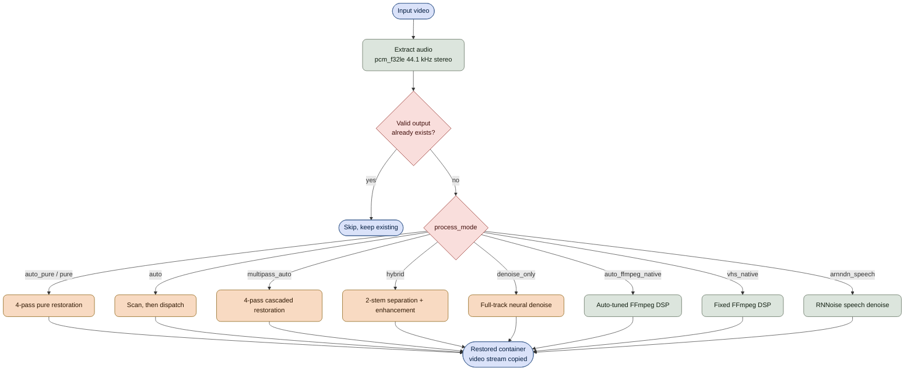

## Shared Stage: Acoustic Scan and Strategy

`scan_and_decide_restoration_strategy` builds one profile that every downstream
stage reads. Model choices, enhancement parameters, sync method, and mix gains
all come from this single decision.

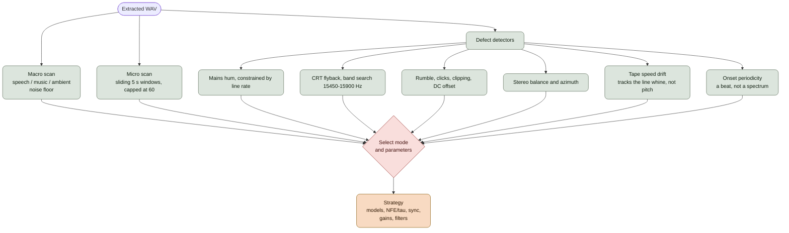

The strategy carries `mode`, `vocals_model`, `denoise_model`, `arnndn_model`,
`enhance_nfe`, `enhance_tau`, `sync_method`, the two mix gains, and the
`precondition_filters` block. The noise floor is sampled across the whole
recording rather than its opening seconds, which on real tapes swung the
estimate by a median of 9.8 dB.

Tape speed drift is measured against the PAL/NTSC horizontal line whine recorded
on the tape, a fixed physical frequency. Musical pitch moves the dominant
spectral peak but never moves that reference, so program content cannot be
mistaken for drift. A recording carrying no usable reference is reported stable,
which keeps the fast, artifact-free `shift` alignment as the default.

## Shared Stage: Analog Pre-Conditioning

Applied by `auto_pure` and `multipass_auto` before any AI stage. Every filter is
conditional: the chain collapses to `anull` when no defect is detected.

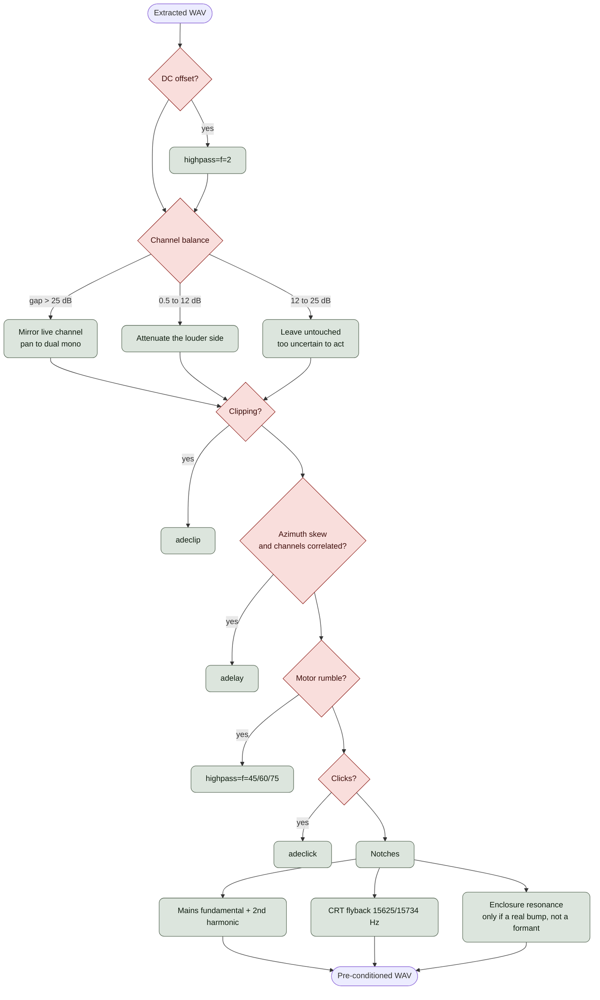

A channel gap wider than 25 dB means a dead channel rather than a level
mismatch, so the live side is mirrored to both rather than attenuating the only
channel carrying audio. The azimuth delay is applied only when the two channels
actually correlate, because a lag measured against a silent channel is noise.

## Shared Stage: Mastering and Mux

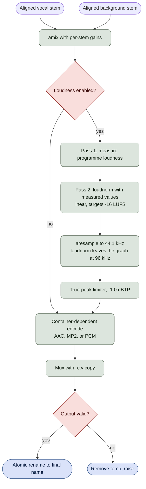

If the measurement pass fails or returns an incomplete block, the pipeline logs
a warning and falls back to single-pass normalization rather than aborting.

Single-track modes share this chain. They carry one processed stream instead of
two stems, so the graph starts at `[1:a]` rather than an `amix`, but the
measurement pass, resample, and limiter are the same code. The mastered stream is
routed through a `filter_complex` label rather than `-af`, because the optional
archival track is a second audio output that must not be normalized.

## Mode: `auto_pure` (default)

Pure speech and ambient restoration with no generative vocoder synthesis. The
speech stem is denoised and de-essed, never resynthesized.

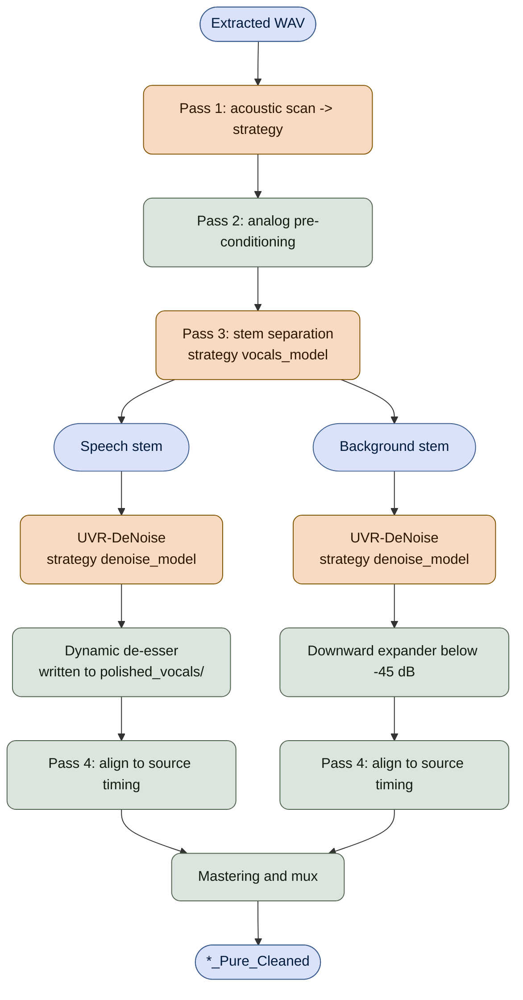

De-essed output is written to a dedicated `polished_vocals/` directory so a
resumed run cannot mistake an already de-essed file for a fresh stem.

## Mode: `auto`

Profiles the audio, then runs whichever pipeline the strategy selects. When
`enable_multipass` is set and the strategy chooses `hybrid`, the multipass
pipeline runs instead.

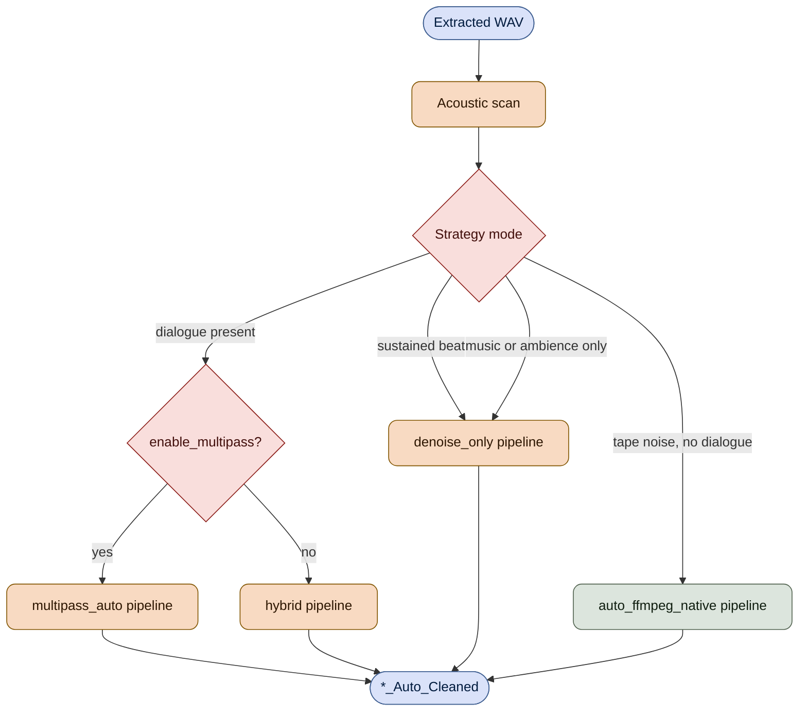

Rhythm is tested before the dialogue gate. Sung vocals occupy the same
300–3400 Hz band as speech, so a music video trips every speech test and would
otherwise always reach stem separation. Measured on a labelled corpus of 21
speech tapes and 27 music-video slices, the shipped tonal-peak ratio scored at
chance; onset periodicity keeps all 21 speech tapes on the separation path while
routing 19 of 27 music slices to `denoise_only`.

Note that `auto` is the only mode that acts on this decision. `auto_pure`,
`hybrid`, and the rest name one specific pipeline and run it regardless.

## Mode: `multipass_auto`

Same four passes as `auto_pure`, but the speech stem goes through
Resemble-Enhance generative reconstruction instead of pure denoising.

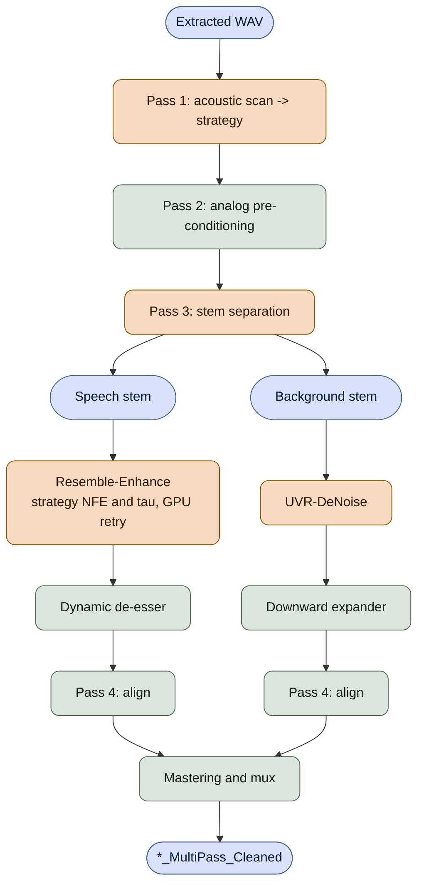

## Mode: `hybrid`

The same separation and enhancement chain, run directly on the extracted audio
with no pre-conditioning pass.

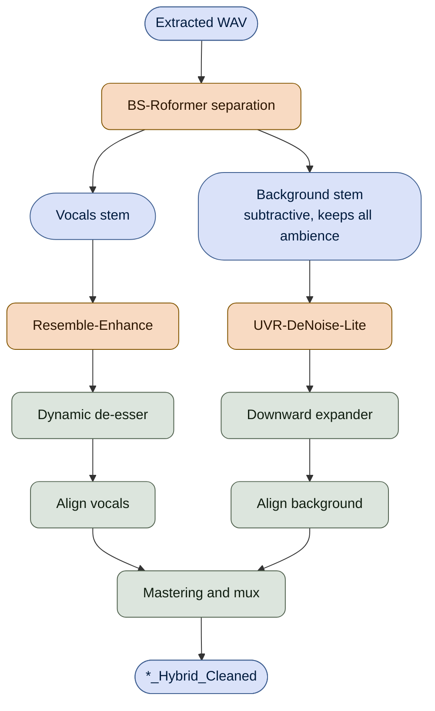

The background stem is the companion output of vocal separation rather than a
dedicated music model, which guarantees non-vocal audio such as birds and room
tone is retained in full.

## Mode: `denoise_only`

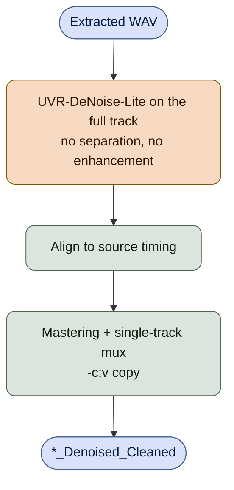

## Mode: `auto_ffmpeg_native`

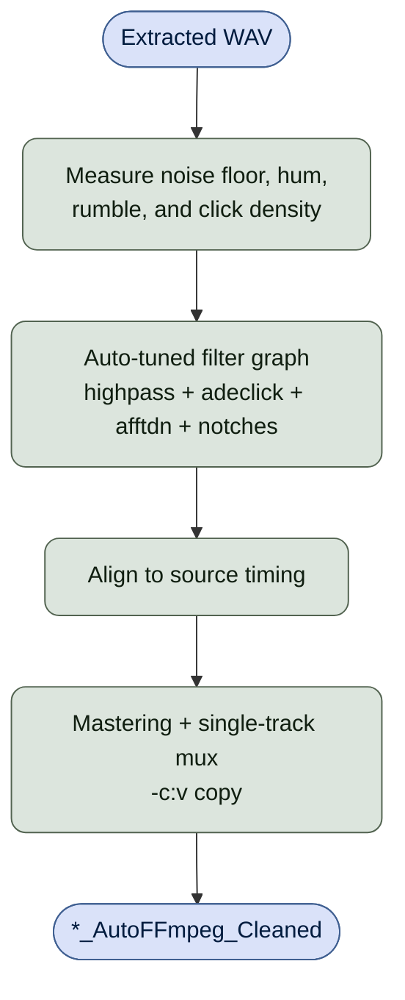

## Mode: `vhs_native`

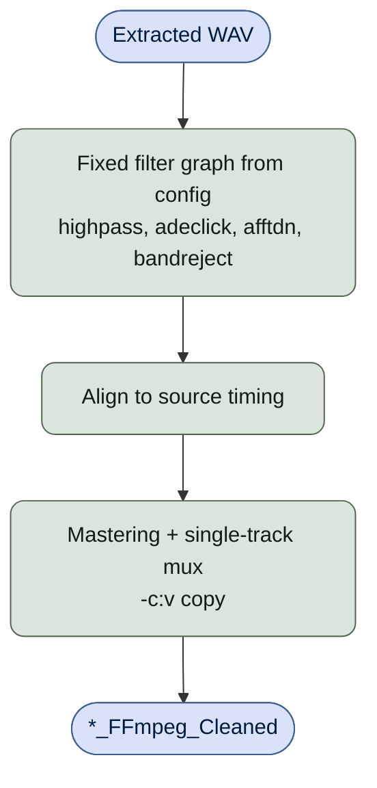

## Mode: `arnndn_speech`

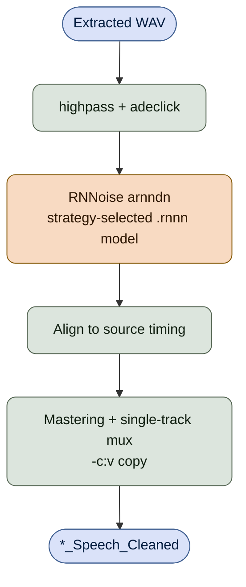

## Synchronization

Both alignment methods restore the processed track to the source timing so the
result stays in sync with the untouched video stream.

- `shift`: global cross-correlation lag correction. Fast and artifact-free.
- `dtw`: Dynamic Time Warping for variable drift, GPU `torch.cdist` distance
  with CPU pathfinding and a `fastdtw` fallback.

The scanner selects `dtw` only when the line-whine reference shows measurable
speed instability; otherwise `shift` is used.

## Runtime Composition

- Python 3.12.x.
- Poetry-managed dependencies with platform-specific wheel markers.
- NVIDIA CUDA (Linux / Windows) and Apple Silicon MPS (macOS) acceleration.
- FFmpeg and FFprobe auto-discovery across `.venv/bin`, `.venv/Scripts`, and
  system PATH.
- Separator models resolve to a single package-anchored store, so running the
  CLI from any working directory reuses the same downloads.

## Reliability Design

- Every expensive stage checks for a valid existing output before running.
- Resume checks use validity helpers, never bare existence.
- Media is written to a temporary name and atomically renamed once verified.
- Downloaded models (ARNNDN `.rnnn` and separator checkpoints) undergo
  integrity validation; corrupted or truncated files are automatically deleted
  and re-downloaded cleanly.
- Intermediate audio stays 32-bit float end to end; stems that a separator
  emits as fixed-point are converted back.
- Stem detection accepts every naming convention `audio-separator` emits,
  case-insensitively.
- Temporary work directories are isolated per input and preserved on failure.

## Quality Gates

Local canonical gate:

```bash
./run_pipeline_locally.sh
```

```powershell
powershell -NoProfile -ExecutionPolicy Bypass -File .\run_pipeline_locally.ps1
```

Gate stages: PowerShell lint, Ruff, Black, isort, Taplo, Flake8, Pylint, Bandit,
pip-audit, Radon CC/MI pass gates, Markdown format check and lint, pytest with
the shared coverage threshold, strict per-file coverage from `coverage.json`,
and coverage badge regeneration.
