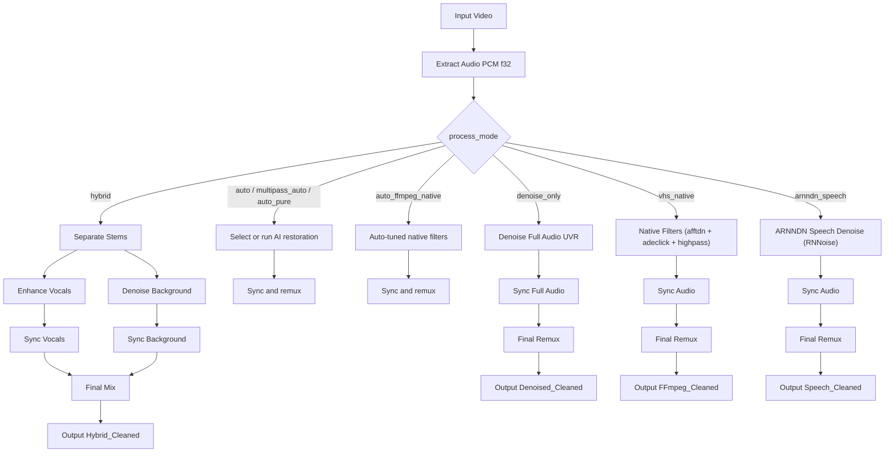

# Key Logic & Pipeline

The script `restore_audio_hybrid.py` supports eight primary restoration flows:
`auto`, `multipass_auto`, `auto_pure`, `hybrid`, `denoise_only`,
`auto_ffmpeg_native`, `vhs_native`, and `arnndn_speech`. The descriptions and
diagram below focus on the representative direct pipelines; `multipass`,
`pure`, `ffmpeg_native`, and `auto_vhs_native` are compatibility aliases.

## `hybrid` flow

1. **Extraction**: FFmpeg extracts audio as `pcm_f32le` (32-bit float).
1. **Separation**:
   - **Vocals**: BS-Roformer-Viperx-1297.
   - **Background**: companion stem from separation (normalized to
     `(Background)` naming).
1. **Vocal Enhancement**: Resemble-Enhance cleans and improves vocal clarity.
1. **Background Denoising**: UVR-DeNoise-Lite denoises background stem.
1. **Smart Sync**: Vocals and background are aligned to original timing (`shift`
   or `dtw`).
1. **Final Mix**: FFmpeg combines aligned stems into `*_Hybrid_Cleaned.<ext>`
   with container-dependent audio encoding (AAC for `.mp4`/`.m4v`, MP2 for
   `.mpg`/`.mpeg`, and 32-bit PCM only for configured PCM-capable
   containers).

## `auto_pure` flow

1. **Extraction**: FFmpeg extracts audio as `pcm_f32le` (32-bit float).
1. **Pass 1 (Acoustic Scan)**: Dual-resolution acoustic profile analysis.
1. **Pass 2 (Pre-Conditioning)**: DC blocker, stereo balance handling, azimuth
   delay, declip, and notching. Every stage is conditional; the chain collapses
   to `anull` when no defect is detected.
   - A channel gap wider than 25 dB is a dead channel, not a level mismatch, so
     the live channel is mirrored to both sides instead of attenuating it.
   - The azimuth delay is applied only when the channels actually correlate.
   - Mains notching is limited to the family the detected video line rate
     allows, and always includes the fundamental even when a harmonic was the
     strongest peak.
   - The enclosure resonance notch requires a high-contrast bump in the smoothed
     spectral envelope, so speech formants are not notched.
1. **Pass 3 (AI Separation & Pure Denoise)**:
   - **Speech Stem**: Dedicated UVR-DeNoise + dynamic de-esser (bypassing
     generative vocoder synthesis).
   - **Music & Ambient Stem**: Conserved and cleanly denoised with UVR-DeNoise
     - downward dynamic expander below -45 dB.
1. **Pass 4 (Smart Sync & Mix)**: Sub-sample DTW/shift alignment, 32-bit float
   `amix`, then two-pass EBU R128 loudness normalization followed by a true-peak
   limiter and a resample back to 44.1 kHz.
1. **Final Remux**: Stream-copied container remux into `*_Pure_Cleaned.<ext>`.

## `denoise_only` flow

1. **Extraction**: FFmpeg extracts audio as `pcm_f32le` (32-bit float).
1. **Full-audio denoise**: UVR-DeNoise-Lite denoises the extracted full track.
1. **Smart Sync**: The denoised full track is aligned to original timing
   (`shift` or `dtw`).
1. **Final Remux**: FFmpeg remuxes the aligned full track into
   `*_Denoised_Cleaned.<ext>` with container-dependent audio encoding (AAC
   for `.mp4`/`.m4v`, MP2 for `.mpg`/`.mpeg`, and 32-bit PCM only for
   configured PCM-capable containers).

## `vhs_native` flow

1. **Extraction**: FFmpeg extracts audio as `pcm_f32le` (32-bit float).
1. **Native VHS Filtering**: FFmpeg multi-threaded DSP filter chain:
   - Mechanical rumble removal (`highpass=f=60`).
   - Impulsive click & pop interpolation (`adeclick`).
   - Continuous adaptive noise floor tracking (`afftdn=nr=12:nf=-45:tn=1`).
   - Optional Hi-Fi head-switching notch filter (`bandreject`).
1. **Smart Sync**: The filtered track is aligned to original timing (`shift` or
   `dtw`).
1. **Final Remux**: FFmpeg remuxes the aligned track into `*_FFmpeg_Cleaned.<ext>`
   with container-dependent audio encoding (AAC for `.mp4`/`.m4v`, MP2 for
   `.mpg`/`.mpeg`, and 32-bit PCM only for configured PCM-capable
   containers).

## `arnndn_speech` flow

1. **Extraction**: FFmpeg extracts audio as `pcm_f32le` (32-bit float).
1. **ARNNDN Speech Denoising**: FFmpeg Recurrent Neural Network denoiser:
   - Rumble and click suppression (`highpass=f=60`, `adeclick`).
   - Deep-learning RNNoise speech denoiser (`arnndn=m=cb.rnnn`).
1. **Smart Sync**: The speech-denoised track is aligned to original timing
   (`shift` or `dtw`).
1. **Final Remux**: FFmpeg remuxes the aligned track into
   `*_Speech_Cleaned.<ext>` with container-dependent audio encoding (AAC for
   `.mp4`/`.m4v`, MP2 for `.mpg`/`.mpeg`, and 32-bit PCM only for configured
   PCM-capable containers).

## Mastering chain

Every mode ends in the same mastering chain, including the single-track modes
(`denoise_only`, `vhs_native`, `auto_ffmpeg_native`, `arnndn_speech`), which
previously remuxed with no loudness stage at all.

Loudness normalization runs in two passes. The first measures the finished mix,
and the second applies `loudnorm` with those measured values so the target is
hit exactly rather than approximated. Some FFmpeg builds change the sample rate
while processing `loudnorm`, so the chain explicitly resamples to 44.1 kHz and
ends with a true-peak limiter that guarantees the -1.0 dBTP ceiling. If
measurement fails the pipeline logs a warning and falls back to single-pass
normalization.

## Sync methods

- **Global Shift (Cross-Correlation)**: Calculates a single best-fit offset
  (`ref[t] = proc[t + lag]`).
- **Dynamic Time Warping (DTW)**: Hybrid GPU+CPU approach for non-linear drift
  (wow/flutter/speed changes).

DTW is selected automatically only when the tape's recorded video line whine
shows measurable speed instability. Programme pitch changes move the dominant
spectral peak but not that reference, so music and dialogue cannot be mistaken
for drift, and a recording carrying no usable reference stays on `shift`.

