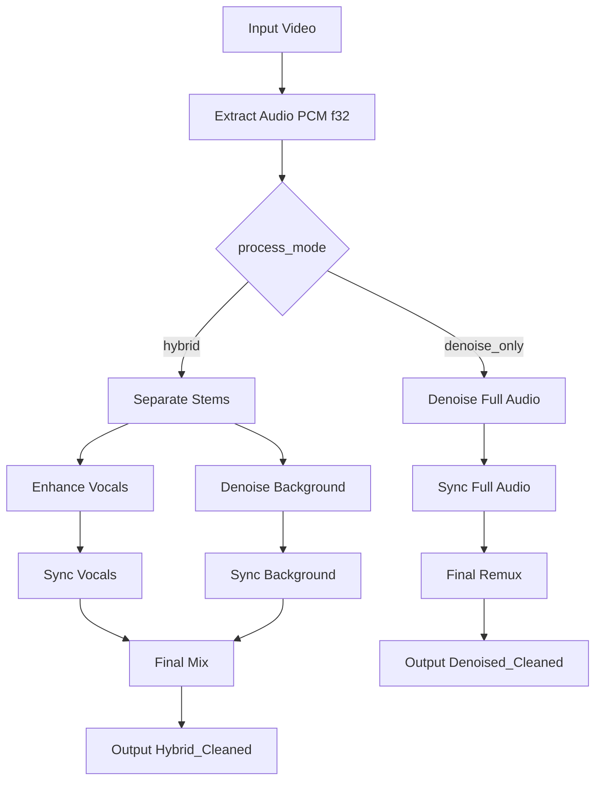

# Key Logic & Pipeline

The script `restore_audio_hybrid.py` supports two restoration flows selected by `process_mode`.

## `hybrid` flow

1. **Extraction**: FFmpeg extracts audio as `pcm_f32le` (32-bit float).
2. **Separation**:
   - **Vocals**: BS-Roformer-Viperx-1297.
   - **Background**: companion stem from separation (normalized to `(Background)` naming).
3. **Vocal Enhancement**: Resemble-Enhance cleans and improves vocal clarity.
4. **Background Denoising**: UVR-DeNoise-Lite denoises background stem.
5. **Smart Sync**: Vocals and background are aligned to original timing (`shift` or `dtw`).
6. **Final Mix**: FFmpeg combines aligned stems into `*_Hybrid_Cleaned.<ext>` with 32-bit PCM audio.

## `denoise_only` flow

1. **Extraction**: FFmpeg extracts audio as `pcm_f32le` (32-bit float).
2. **Full-audio denoise**: UVR-DeNoise-Lite denoises the extracted full track.
3. **Smart Sync**: The denoised full track is aligned to original timing (`shift` or `dtw`).
4. **Final Remux**: FFmpeg remuxes the aligned full track into `*_Denoised_Cleaned.<ext>` with 32-bit PCM audio.

## Sync methods

- **Global Shift (Cross-Correlation)**: Calculates a single best-fit offset (`ref[t] = proc[t + lag]`).
- **Dynamic Time Warping (DTW)**: Hybrid GPU+CPU approach for non-linear drift (wow/flutter/speed changes).

